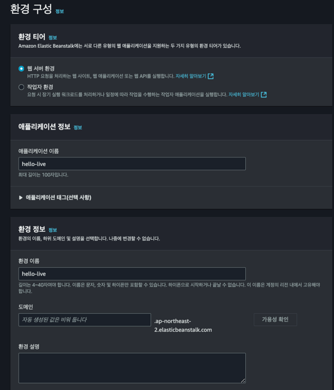
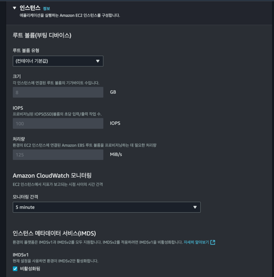

Docker를 사용해서 애플리케이션을 배포하는 방법에는 ECS, EKS, Beanstalk 등이 있습니다.

ECS나 EKS같은 오케스트레이션 서비스는 MSA 같이 분산된 서버를 구축할 때 유용하지만 진입 장벽과 관리 비용이 비교적 높습니다.

반면, Elastic Beanstalk는 Docker 이미지를 간편하게 배포할 수 있는 플랫폼으로, 
EC2 인스턴스에 자동으로 배포하고 관리해 주기 때문에 상대적으로 간단하게 Docker를 이용해서 서버 환경을 보장할 수 있습니다. 
또한, Beanstalk는 애플리케이션 환경 설정 및 모니터링을 위한 다양한 기능을 제공하기 때문에 빠르게 서버를 구축하기에 매우 적합합니다.

그래서 이번에 Spring Boot 애플리케이션을 도커 이미지로 빌드해서 Elastic Beanstalk으로 배포했던 과정을 간단하게 공유해보겠습니다.

## 애플리케이션

---

### Rest API

빠르게 "Hello, World"를 반환하는 API를 만들겠습니다.

```kotlin
@RestController
@RequestMapping("/")
class HelloController {
    @GetMapping
    fun hello() = "Hello, World"
}
```

`http://localhost:8080`를 호출해 페이지 렌더링 테스트를 진행합니다.


<br>

### application.yml

환경별 설정 값을 작성합니다.

```yaml
spring.application.name: hello

---
spring.config.activate.on-profile: local-container

spring:
  servlet:
    multipart:
      max-request-size: 1GB
      max-file-size: 1GB

---
spring.config.activate.on-profile: local

spring:
  servlet:
    multipart:
      max-request-size: 1GB
      max-file-size: 1GB

---
spring.config.activate.on-profile: live

spring:
  servlet:
    multipart:
      max-request-size: 5GB
      max-file-size: 5GB
```

<br>

## 도커 파일

---

Spring Boot 애플리케이션을 Docker 이미지로 빌드하기 위해 Dockerfile을 작성합니다. Dockerfile의 기본 이미지는 OpenJDK를 사용하고, 프로젝트 JAR 파일을 복사하여 실행하는 구조로 구성됩니다.

```shell
mkdir Dockerfile
vi Dockerfile
```

프로젝트 루트 경로에 Dockerfile을 생성하고 다음을 입력합니다.

```dockerfile
FROM bellsoft/liberica-openjdk-alpine:17
ARG JAR_FILE=build/libs/*.jar

RUN apk add --no-cache tzdata \
    && cp /usr/share/zoneinfo/Asia/Seoul /etc/localtime \
    && echo "Asia/Seoul" > /etc/timezone \
    && apk del tzdata

COPY ${JAR_FILE} app.jar
EXPOSE 8080
ENTRYPOINT ["java", "-Dfile.encoding=UTF-8", "-Dspring.profiles.active=${ACTIVE}", "-jar","/app.jar"]

```

Beanstalk은 JAVA 플랫폼을 이용할 경우, Nginx가 기본적으로 세팅되며 5000포트를 사용해야 합니다. 이외 포트를 사용하고 싶다면 Nginx를 재설정해줘야 합니다.

반면 도커 플랫폼을 이용하면 Nginx 사용은 선택이며, 원하는 포트를 자유롭게 지정할 수 있다는 장점이 있습니다.

`RUN`은 Dockerfile에 타임존을 서울로 설정하기 위해 tzdata 패키지를 설치하고 삭제합니다.
이와 같이 동일한 이미지의 컨테이너는 동일한 타임존을 가지고, 동일한 라이브러리 사용을 도커를 통해 보장할 수 있습니다.

`ARG`는 Dockerfile에서 사용할 변수를 정의한 것 입니다.

`ACTIVE`는 Beanstalk 구성에서 정의하는 환경변수에 따라 동적으로 할당될 변수입니다. 

<br>

## 로컬 실행

---

```shell
./gradlew build
docker build -t hello-app .
docker run --rm -p 3000:8080 -e ACTIVE=local-contatiner hello-app
```

위 명령을 순서대로 실행한 뒤, `http://localhost:3000`을 접속했을 때 이전과 같은 페이지가 렌더링 되어야합니다.

<br>

## 이미지 업로드

---

빌드된 이미지를 저장소에 업로드 후 빈스톡 배포 시 주소를 공유해줄 것 입니다. 
이를 통해 인스턴스에서 해당 주소의 이미지를 가져와 컨테이너를 실행시킵니다.

이미지 저장소는 대표적으로 DockerHub와 ECR이 있습니다.
이외에도 프라이빗 저장소를 구축해서 사용할 수 있습니다.

저는 ECR에 이미지를 업로드하도록 하겠습니다.


먼저 ECR 콘솔로 이동해서 우측 상단의 `리포지토리 생성`을 클릭합니다.


리포지토리 이름을 정의하고 생성버튼을 클릭합니다.

리포지토리 생성이 완료되면 빌드한 이미지를 푸시합니다.
푸시 방법을 모두 기술하기에는 글이 너무 중구난방해져서 따로 작성하지 않습니다.
[AWS 공식문서](https://docs.aws.amazon.com/ko_kr/AmazonECR/latest/userguide/docker-push-ecr-image.html)를 참고하면 쉽게 업로드할 수 있습니다. 

<br>

## 빈스톡 설정 파일

---

빈스톡에서 도커 이미지를 관리하려면 `Docker-Compose`를 사용하거나 `Dockerrun.aws.json` 파일을 구성해야합니다.

저는 `Dockerrun.aws.json`를 구성해보도록 하겠습니다.

```json
{
  "AWSEBDockerrunVersion": "1",
  "Image": {
    "Name": "**********.dkr.ecr.ap-northeast-2.amazonaws.com/hello",
    "Update": "true"
  },
  "Ports": [
    {
      "ContainerPort": "8080",
      "HostPort": "5000"
    }
  ]
}
```

1. **AWSEBDockerrunVersion**: 이 항목은 Dockerrun 파일의 버전을 나타냅니다. 여기서는 "1"로 설정되어 있는데, AWS Elastic Beanstalk의 첫 번째 버전 형식을 사용하고 있음을 의미합니다.

2. **Image**:
    - **Name**: Docker 이미지의 경로를 지정합니다. ECR로 이미지를 업로드했다면 해당 이미지의 url을 입력합니다.
    - **Update**: 이 항목이 `true`로 설정되어 있으면, Elastic Beanstalk가 배포할 때 이미지가 변경되면 자동으로 업데이트하도록 지시합니다.

3. **Ports**: 호스트 간의 포트 매핑을 설정합니다.
    - **ContainerPort**: 컨테이너 내에서 애플리케이션이 수신 대기하는 포트를 나타냅니다.
    - **HostPort**: 호스트에서 노출되는 포트를 지정합니다.

<br>

## 빈스톡 환경 

---

AWS Beanstalk 콘솔로 이동 후, 환경 생성을 클릭합니다.



애플리케이션 이름과 환경이름을 적어줍니다.


플랫폼은 Docker를 선택하고 고가용성을 선택합니다.

고가용성을 선택하는 이유는 단일 인스턴스를 선택할 시 로드밸런서가 구축되지 않기때문에 빈스톡을 백분 활용하지 못하기 때문입니다.


기존에 사용했던 역할이 있다면 선택해주고, 그렇지 않은 경우 새로 생성해줍니다.


이용할 VPC를 선택하고 퍼블릭 IP 주소를 활성화해줍니다.

그리고 인스턴스 서브넷을 선택합니다.

데이터베이스를 함께 구축하지 않을 것이기에 넘어가고 다음을 클릭합니다.



인스턴스는 기본 설정을 유지합니다.


용량은 과금방지를 위해 최솟값 1, 최대값 1을 선택합니다.


인스턴스 유형은 프리티어 사용을 위해 t3.micro를 선택합니다.


필요에 맞게 크기조정 트리거도 설정합니다.

로드밸런서와 리스너 설정도 기본으로 둔 채 다음을 클릭합니다.


프록시서버를 `none`으로 선택해주고 로그스트리밍을 활성화 합니다.

그리고 환경변수 `ACTIVE`를 정의해줍니다.

마지막으로 다음을 클릭하고 전체 설정을 검토 후 생성을 진행합니다.


<br>

## 배포

---

배포 방법에는 수동배포와 자동배포가 있습니다.

두 방법 모두 소개드리도록 하겠습니다.

### 수동배포

수동배포를 하기 위해선 직접 빈스톡에 업로드할 압축 파일을 생성해야 합니다.

현재 압축해야 할 파일은 `Dockerrun.aws.json` 하나 입니다. 만약 `.ebextensions`도 설정하셨다면 함께 압축해주시면 됩니다.


압축이 완료되면 빈스톡 콘솔의 우측 상단 `업로드 및 배포`를 클릭합니다.


파일 선택을 클릭 후 압축 파일을 선택하여 배포를 진행합니다.

### 자동배포

자동배포는 Github Actions를 이용합니다.

그 전에 먼저 압축파일을 업로드 할 s3 버킷을 생성해줍니다.


s3콘솔에서 이렇게 모든 퍼블릭 엑세스를 차단한 배포용 버킷을 하나 생성합니다.


Github Actions는 프로젝트의 루트 경로에 `.github/workflows`에 존재하는 yml 파일에 의해 동작합니다.
`.github/workflow`에 `deploy.yml` 파일을 만들고 다음과 같이 작성해줍니다.

```yaml
name: Deploy API Live

on:
  push:
    branches:
      - master

jobs:
  build:
    runs-on: ubuntu-latest
    steps:
      - uses: actions/checkout@v3
      - name: Set up JDK 17
        uses: actions/setup-java@v3
        with:
          java-version: '17'
          distribution: 'temurin'

      - name: Grant execute permission for gradlew
        run: chmod +x gradlew

      - name: Cache Gradle packages
        uses: actions/cache@v2
        with:
          path: ~/.gradle/caches
          key: ${{ runner.os }}-gradle-${{ hashFiles('**/*.gradle*', '**/gradle-wrapper.properties') }}
          restore-keys: |
            ${{ runner.os }}-gradle-

      - name: Build with Gradle
        run: ./gradlew build 

      - name: Configure AWS credentials
        uses: aws-actions/configure-aws-credentials@v1
        with:
          aws-access-key-id: ${{ secrets.AWS_ACCESS_KEY_ID }}
          aws-secret-access-key: ${{ secrets.AWS_SECRET_ACCESS_KEY }}
          aws-region: ap-northeast-2

      - name: Login to Amazon ECR
        id: login-ecr
        uses: aws-actions/amazon-ecr-login@v1

      - name: Build, tag, and push image to Amazon ECR
        id: build-image
        env:
          ECR_REGISTRY: ${{ steps.login-ecr.outputs.registry }}
          ECR_REPOSITORY: hello
          IMAGE_TAG: latest
        run: |
          docker build -f ApiDockerfile -t $ECR_REGISTRY/$ECR_REPOSITORY:$IMAGE_TAG .
          docker push $ECR_REGISTRY/$ECR_REPOSITORY:$IMAGE_TAG
          echo "::set-output name=image::$ECR_REGISTRY/$ECR_REPOSITORY:$IMAGE_TAG"

      - name: Prepare deployment package
        run: |
          mkdir -p deploy
          cp Dockerrun.aws.json deploy/Dockerrun.aws.json
          cd deploy
          zip -r ../deploy-package.zip .
          cd ..

      - name: Upload package to S3 bucket
        run: aws s3 cp deploy-package.zip s3://hello-deploy/

      - name: Generate unique variable based on timestamp
        run: echo VERSION_VAR=hello-$(date +%Y-%m-%d-%H:%M:%S) >> $GITHUB_ENV

      - name: Publish Eb Version
        run: |
          aws elasticbeanstalk create-application-version \
          --application-name hello-live \
          --source-bundle S3Bucket="hello-application-live",S3Key="deploy-package.zip" \
          --version-label "${{ env.VERSION_VAR }}" \
          --description "${{ env.VERSION_VAR }}"
        shell: bash
```

`secrets`는 `Github Secrets`에 설정된 값을 읽어오는 것 입니다.
설정 방법은 [github 공식문서](https://docs.github.com/ko/actions/security-for-github-actions/security-guides/using-secrets-in-github-actions)를 참고하면 됩니다. 

일반적으로 빈스톡에 배포한다고 하면 자동으로 s3 버킷을 생성하고 업로드하는 플러그인을 많이 사용하는데요.

저는 `master`에 `push`되었다고 해서 배포가 바로 진행되는 것을 선호하지 않아서, 배포 버튼을 개발자가 직접 클릭했을 때만 배포가 진행될 수 있게 버전 업로드 까지만 하는 편입니다.

yml 작성까지 완료됐다면, Github으로 `push` 해줍니다.


Github Wokrflows의 작업이 정상적으로 완료되면 Beanstalk 콘솔에서 우측 상단 `업로드 및 배포`를 클릭하고 정보 박스 내 `애플리케이션 버전 페이지`를 클릭해서 이동합니다.

이동된 페이지에서는 새로 업로드 된 버전을 확인할 수 있습니다.


신규 버전을 선택하고 다시 우측 상단의 작업을 클릭 후 배포를 클릭합니다.
그리고 환경 선택 후 배포를 진행합니다.

---

<br>

여기까지 완료함으로써 빈스톡에서 애플리케이션 도커 컨테이너 배포가 마무리 되었고 빈스톡 도메인으로 접속하면 처음 로컬 Rest API를 테스트 했을 때와 같은 화면을 확인할 수 있습니다.