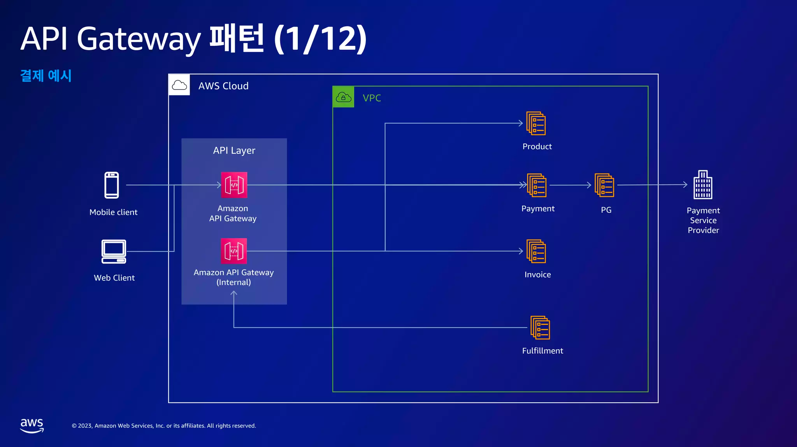
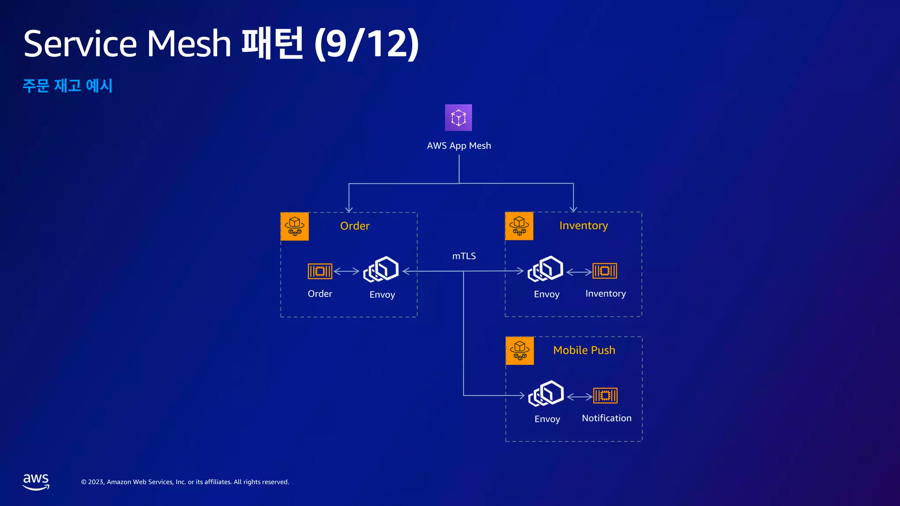
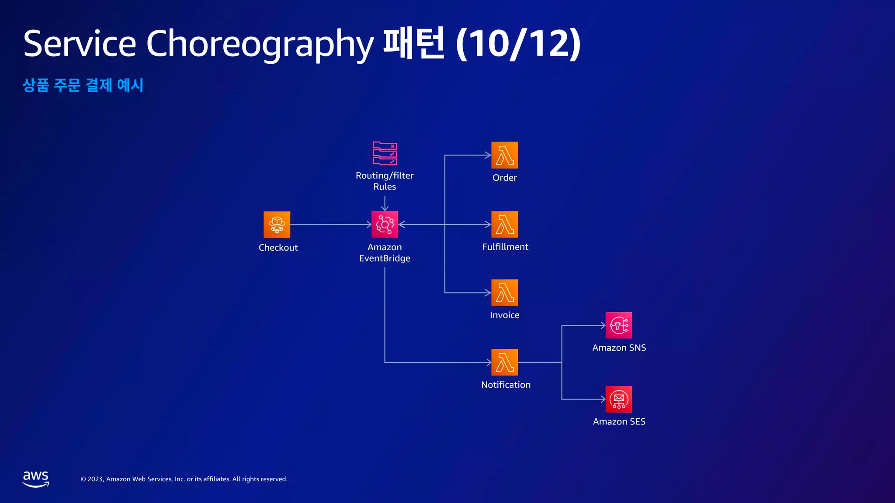
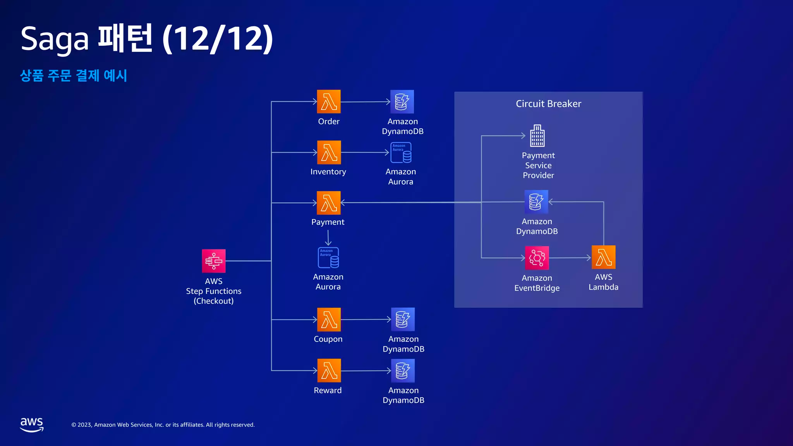

### 참여 계기 

회사에서는 AWS를 사용하고 있는데, 가끔 유지보수나 테스트를 위해 인프라 설정을 건드려야 할 때 두려움과 막막함을 느꼈다.\
그래서 얼마전부터 aws에 대한 이해도를 높이기 위해서 AWS fundamental 자격증 준비를 시작했고, aws에 대한 호기심이 많아지고 있던 찰나, aws summit이라는 좋은기회가 생겨 참가를 신청하게 되었다.

개인 연차를 사용하고 가야해서 고민을 많이 했지만 5월 4일에 개발자를 위한 세션을 여는 점, 그 다음날이 공휴일인 점 때문에 참여를 결정했다.

얼마전까지 회사에 CTO가 있을 때는 IT 컨퍼런스 참석은 연차 사용없이 다녀올 수 있게 해줬는데, CTO와 개발팀장 모두 퇴사를 하고나니 회사에서 개발 활동들에 대한 지원이 많이 적어지고 있어 아쉽다.

&#x20;

&#x20;

### 세션 종류 

&#x20;

Day1에서는 산업 업종별로 강연 세션이 열렸다.

> "AWS 모니터링 및 관측성 담당 부사장 난디니 라마니 (Nandini Ramani)의 기조 연설과 함께, 42개 세션에서 소개하는 산업 업종별 고객 혁신 사례와 클라우드 도입 노하우를 만나보세요. AI, NFT, 슈퍼앱 등 산업 전반에 걸친 화두를 소개하는 메가트랜드 트랙과 함께, 주요 산업별 고객 사례를 다루는 클라우드 네이티브, 금융 및 핀테크, 미디어 및 통신, 리테일 및 디지털 커머스, 제조 및 하이테크, 그리고 공공 부문 트랙이 준비되어 있습니다."

&#x20;

&#x20;

&#x20;

Day2에는 기술 주제별로 강연 세션이 열렸다.

> "8개 트랙 48개 강연을 통해 AWS의 주요 서비스인 컴퓨팅, 네트워킹, 스토리지, 데이터베이스뿐만 아니라, 인공지능 및 기계 학습, 분석, 보안, 데브옵스 및 모던 애플리케이션, SaaS, 마이그레이션 등의 분야의 최신 기술을 만나보세요. 또한 AWS 한국 사용자 커뮤니티에서 직접 소개하는 AWS 도입 경험 강연을 통해, 클라우드 도입 노하우를 배워보실 수 있습니다."

&#x20;

&#x20;

나는 Day2에 참여를 했다.\
아무래도 사내에서 사용중인 서비스들에 더 눈길이 갔고, 그래서 다음 세션들에 참여했다.

* 기조연설
* 잘나가는 애플리케이션 성능? 알맞은 스토리지로부터!
* 스마트한 클라우드 스토리지 전략
* 12가지 디자인 패턴으로 알아보는 네이티브 마이크로서비스 아키텍처
* Datadog을 활용한 AWS 서버리스 Observability

&#x20;

&#x20;

### 강연 내용 정리 

#### 기조연설 

\
9시30분 시작이어서 넉넉하게 9시쯤 도착해서 입장했다.\
코엑스 B홀을 지하1층부터 3층까지 4개 층을 사용했는데, 3층(기조연설 라이브 층)은 꽉 차서 순서대로 2층(화상강연 층) 부스로 들어왔다. 일찍온다고 왔는데도 라이브 좌석을 차지하게에는 좀 늦었었나보다.

AWS 윤석찬 수석테크에반젤리스트의 진행으로 기조연설이 시작되었다.\
먼저 AWS가 추구하는 바를 드라마로 만들어서 보여주었는데 CTO가 연기를 의외로 잘해서 놀라웠다. 드라마 내용은 비동기로 돌아가고 있는 세상에 살고 있는 주인공이 동기적으로 돌아가는 세상을 경험하게 되는 이야기였는데 진지하게 분석하면서 보기보단 그냥 웃으며 시작하자는 의도의 드라마였다.

그리고 CTO와 서버리스 컴퓨팅 부사장 Holly Mesrobian의 간단한 연설이 이어졌고, 그 다음 AWS의 사용 경력이 많은 플리토의 강동한 CTO, LG U+의 송주영 CTO 두 명과의 인터뷰가 진행되었다.

aws의 어떤 점이 좋았는지, 실무에서 사용하면서 아찔했던 경험은 뭐 였는지 같은 aws 사용 경험들을 물어봤다.\
이 들의 인터뷰에서 가장 기억에 남는 것은 송주영 CTO가&#x20;

`오픈소스 기여는 내 커리어를 위한 것이 아닌 개발자라면 해야하는 의무이다.`라는 말이다.\
이 얘기를 듣자마자 가슴에 저 문구가 콱 박히면서 너무 공감이 되었고, 무의식적으로 오픈소스는 커리어를 위한것이라 생각했던 것이 부끄럽기도 하였다.

&#x20;

#### 잘나가는 애플리케이션 성능? 알맞은 스토리지로부터! 

* 디스크 성능 최적화를 위한 전략
    * 성장에 따른 적합한 인스턴스를 선택
    * 벤치마킹을 통해서 끊임없는 성능추적을 하여 메모리, 디스크, CPU 비율을 계산하고 이에 맞는 인스턴스 타입을 선택하여 블록 스토리지와 인스턴스 성능 간 최적화
    * TWP(손상된 쓰기 방지) 기능을 통한 데이터베이스 성능 향상
    * 일반적으로 데이터베이스는 손상된 쓰기를 방지하기 위해 로깅 매커니즘을 사용하는데 MariaDB 같은 경우 그것을 이중 쓰기 버퍼, 더블 라이트 버퍼를 사용
    * 이는 스토리지 구조체에서 동작을 하여 오버헤드가 발생할 수 있으며 트랜잭션에 영향을 미침
    * TWP를 사용하게 되면 데이터가 쓰기 트랜잭션을 통해 쓰여지므로 이중 쓰기 버퍼를 사용할 필요가 없어짐
    * 이를 통해 초당 처리되는 트랜잭션 수를 최대 30%까지 늘리고, 쓰기 지연시간을 최대 50% 줄일 수 있음
* 데이터 레이크를 위한 S3
    * 모든 워크로드를 병렬화하라
    * 많은 엔드포인트를 통해 워크로드를 분산하게 되면 높은 수준의 병렬화를 구성할 수 있음
    * 이는 지연시간을 줄이고 처리량을 높이는 매우 효과적인 방법임
    * Prefix를 통해 throughput을 최적화
* 워크로드 패턴
    * 람다사용시 efs를 활용
        * aws 람다는 함수가 호출될 때 실행이 됐다가 실행이 끝나고 되면 종료되는 완전 서버리스 환경을 갖고 있음
        * aws 람다는 함수가 실행되다가 종료되기 직전의 상태를 저장해놓고 다음 번 시작할 때 이 상태를 불러가서 활용하려고 하는 스테이트플한 애플리케이션을 서버리스로 구축할 때도 efs를 스토리지로 활용할 수 있음
    * 연산 집약적 워크로드의 무제한 성능 확장
    * FSx, Amazon File Cache 사용
    * 아마존 캐시는 온프레미스와 클라우드 데이터를 연결할 때 유용

&#x20;

#### 스마트한 클라우드 스토리지 전략 

**모범사례:**

1. 팀 구성
2. 적합한 스토리지 서비스 선택
3. 비용 최적화 기술 활용
4. 모니터링 분석 개선 적용

**오브젝트 스토리지 (S3)**

* 비용 최적화를 위한 시작점: 워크로드에 맞게 S3 스토리지 클래스 선택
    * S3는 내구성과 성능에 따라 서로 다른 비용으로 제공되는 7가지 스토리지 클래스를 제공합니다.
* 데이터에 대한 액세스 패턴 파악
    1. 알고 있거나 예측 가능한 패턴: 수명 주기 규칙 사용
    2. 알 수 없거나 변경되는 패턴: 인텔리전트 티어링
    3. 인텔리전트 티어링은 접근 시간을 기반으로 밀리초 단위의 접근 성능을 제공하며, 아카이브 티어를 활성화하면 접근 성능은 낮아지고 비용이 절감됩니다.
* 모니터링 도구 - S3 스토리지 렌즈
    * S3 스토리지 렌즈는 분석, 대시보드, 모범 사례 권장 등의 기능을 제공하며, S3 콘솔 환경과 클라우드 와치 게시를 통합합니다. 버킷별 검색 비율을 확인하여 스토리지 클래스를 아카이브로 내리면서 비용을 낮출 수 있습니다.

**블록 스토리지 (EBS)**

* EBS는 SSD와 HDD를 제공합니다.
* 컴퓨트 옵티마이즈를 사용하여 EBS를 최적화할 수 있습니다.

**파일 스토리지 (EFS)**

* 비용 최적화
    1. 수명 주기 관리
    2. 정책에 따라 IA(Infrequent Access) 스토리지 클래스로 데이터를 이동합니다.
    3. IA 클래스는 자주 액세스하지 않는 파일을 위한 클래스입니다.
    4. 주의할 점은 스탠다드 클래스에는 없는 액세스 비용이 있으므로, 오히려 비용이 더 많이 발생할 수 있습니다.
    5. 인텔리전트 티어링
    6. 인텔리전트 티어링은 IA 클래스보다 10% 비용이 발생합니다.
    7. 접근 빈도에 따라 자동으로 스탠다드 혹은 IA로 데이터를 이동합니다.
    8. 데이터 전환에는 비용이 발생합니다.

&#x20;

#### 12가지 디자인 패턴으로 알아보는 네이티브 마이크로서비스 아키텍처 

**클라우드 네이티브**

* 현대적이고 역동적인 클라우드 환경에서 확장 가능한 애플리케이션을 개발하고 운영
* 탄력적이고 관리 가능하며 관찰 가능한 느슨하게 결합된 시스템
* 자동화를 통해 빈번하면서도 예측 가능한 변경을 수행

**클라우드 네이티브 + 마이크로 서비스 = 현대화**

* 독립적으로 확장 가능한 마이크로서비스사용
* API를 통해 연결
* 지속적으로 업데이트 전달
* 변화에 빠르게 적용
* 글로벌 확장
* 내결함성
* 상태 및 지속성의 관리
* 보안 기능 내장

**패턴1. API 게이트웨이 패턴**

* 정의 : 마이크로서비스의 비즈니스 기능을 API 소비자에게 통합된 API 엔드포인트로 노출
* 문제 : 백엔드 마이크로서비스의 복잡성과 보안, 라우팅 정책 등을 적용 및 관리하는 단일 엔드포인트 필요
* 해결책 : 라우팅, 보안, 쓰로틀링, 캐싱, 버전 관리 및 기타 정책 등 Cross Cutting Concern을 수행하는 중개자 제공
* AWS 서비스 : Amazon API Gateway

**패턴2. Backend for Frontends 패턴**

* 정의 : 특정 Frontend 애플리케이션의 요구사항에 맞는 API 구현을 위해 Frontend만의 Backend API 서비스 추가
* 문제 : 모바일, 데스크톱, 웹, 등 클라언트 환경별 상이한 요구사항을 충족하기 위한 Frontend의 변경 필요
* 해결첵 : 특정 Frontend 애플리케이션을 위한 맞춤 API를 BFF API로 제공하여 서비스 제공 유연성과 안정성 향상
* AWS 서비스 : Amazon API Gateway, Aws Lambda, AWS AppSync

**패턴3. Strangler Fig 패턴**

* 정의 : 모놀리식 애플리케이션 기능을 새로운 아키텍처에서 마이크로서비스로 점진적인 현대화와 전환하는 패턴
* 문제 : 기존 레거시의 애플리케이션 기능들을 운영환경의 영향없이 연속성 유지하면서 새로운 아키텍처로 이전
* 해결책 : 새로운 마이크로서비스를 클라우드 환경에 구현하고 Reverse Proxy를 사용해서 전환하며 점진적으로 이전
* AWS 서비스 : Amazon API Gateway, Amazon Application Load Balancer

**패턴4. Database per Service 패턴**

* 정의 : 마이크로서비스별로 독립적인 데이터 저장소를 사용하여 데이터베이스의 변경 가능성과 확장성 제공
* 문제 : 마이크로서비스별로 다른 요구사항을 만족시키면서 데이터베이스 변경이 타서비스의 영향을 최소화
* 해결책 : 접근 패턴과 규모 등 목적에 맞는 데이터베이스를 독립적으로 사용하고 API를 통한 공유만 외부에 제공
* AWS 서비스 : AWS Purpose-built Database

**패턴5. CQRS and Event Sourcing 패턴**

* 정의 : 읽기와 쓰기 저장소를 분리하고 이벤트 전달 방식을 사용하여 데이터 일관성을 유지
* 문제 : 단일 데이터베이스가 갖고있는 유연성과 확장성의 한계로인한 쓰기와 읽기 성능의 구조적인 제한
* 해결책 : 읽기와 쓰기별 성능과 데이터 모델 요구에 맞는 별도 저장소를 사용하고 이벤트 저장소를 통해서 동기화
* AWS서비스 : AWS Purpose-built Database, Amazon MSK

**패턴6. Materialized View 패턴**

* 정의 : 계산된 결과 데이터를 Materialized View로 미리 구성해서 실행부에 가깝게 배치하는 방법
* 문제 : 복잡한 조인이나 의존적인 외부 데이터 서비스 영향으로 데이터 조회 성능 저하가 발생
* 해결책 : 요구되는 데이터를 로컬 데이터 저장소나 캐시에 미리 최적의 형식으로 저장하여 조회 성능 향상
* AWS 서비스 : AWS Purpose-built Database, AWS Lambda

**패턴 7. Publish-Subscribe 패턴**

* 정의 : 메시지 발행자가 메시지를 토픽에 발행하면 모든 구독자가 수신하는 비동기 메시지 전달 패턴
* 문제 : 대규모 분산 시스템의 병렬성과 확장성 요구와 동기식 이벤트 전달이 가지느 대기시간 문제
* 해결책 : 복수의 발행자가 메시지 브로커의 토픽으로 전송한 메시지를 복수의 구독자가 모두 수신
* AWS 서비스 : Amazon SNS, Amazon EventBridge, Amazon Kinesis Data Streams, Amazon MSK

**패턴 8. Sidecar 패턴**

* 정의 : 애플리케이션 컨테이너의 기능을 확장하고 강화하는 용도로 사이드카 컨테이너를 추가하는 방식
* 문제 : 애플리케이션 컨테이너의 변경없이 통신, 모니터링, 보안 등의 공통적인 기능을 확장
* 해결책 : 주 컨테이너와 함께 스케줄링 및 동작하는 사이드카 컨테이너를 추가해 재사용 가능한 부가 기능 구현
* AWS 서비스 : Amazon EKS, Amazon ECS

**패턴9. Service Mesh 패턴**

* 정의 : 분산 애플리케이션에서 서비스 간 통신과 보안, 로깅, 로드밸런싱, 모니터링 등의 기능을 중앙에서 관리
* 문제 : 마이크로서비스들과 시스템들 간의 통신에서 연결성 로직을 마이크로서비스가 직접 관리헤야하는 문제
* 해결책 : 서비스간 통신 로직 처리는 Sidecar Proxy를 사용하고 제어는 Control Plane이 담당
* AWS 서비스 : AWS App Mesh, Amazon ECS Service Connect

**패턴10. Service Choreography 패턴**

* 정의 : 여러 마이크로서비스를 조합하는 비즈니스 기능의 구현을 이벤트 기반의 비동기통신으로 합성하는 패턴
* 문제 : 유연성과 확장성, 변경 비용을 고려해서 서비스들간의 낮은 결합도와 비동기 통신이 필요
* 해결책 : 다른 마이크로서비스를 능동적으로 직접 호출하지 않고 이벤트와 메시지를 기반으로 반응 모드로 작동
* AWS 서비스 : Amazon EventBridge, Amazon MSK, Amazon Kinesis Data Streams, Amazon SQS, Amazon SNS

**패턴11. Service Orchestration 패턴**

* 정의 : 중앙 컨트롤러 서비스(Orchestrator)가 서비스 흐름 제어, 서비스 상호작용을 조정하여 프로세스를 관리
* 문제 : 단일 마이크로서비스의 분산에 따른 한계 존재
* 해결책 : 여러 마이크로 서비스에 분산되어 있는 상호작용을 중앙의 단일 서비스를 통해 비즈니스 로직 구현
* AWS 서비스 : AWS Step Functions

**패턴12. Saga 패턴**

* 정의 : 여러 트랜잭션을 그룹으로 관리 및 조정하여 일관성을 유지하도록하는 분산 트랜잭션의 장애관리 패턴
* 문제 : 마이크로서비스 구조에서 긴밀한 결합 없이 여러 마이크로서비스에 걸친 트랜잭션 처리의 복잡성
* 해결책 : 모든 트랜잭션 이벤트를 게시하고 결과에 따라 다음 트랜잭션을 시작, 혹은 실패할 경우 보상 트랜잭션을 실행
* AWS 서비스 : AWS Step Functions

&#x20;

#### Datadog을 활용한 AWS 서버리스 Observability 

**Observability 란?**

* Monitoring
    * 제한된 리소스 메트릭 수집
    * 분산된 로깅 시스템
    * 제한된 분산 트레이싱
    * 단순 메트릭 분석 및 임계치 알림
    * 유연하지 않은 Health Check
* Observability
    * 다양한 리소스 및 플랫폼 메트릭 수집
    * 로그 중앙화
    * 다양한 언어의 End to End 분산 트레이싱
    * 머신러닝 기반 분석 및 알림
    * 유연한 Health Check

**Serverless Observability의 중요성**

* Serverless를 도입하면 비용과 관리부담을 최소화
* 하지만 잘못된 설계와 개발은 비용 증가와 장애분석에 어려움을 가져올 수 있음
* Datadog은 Serverless Observability를 지원하여 비용 최적화와 빠른 장애 대응을 실현할 수 있음

&#x20;

### 후기 

처음 참여했던 오프라인 컨퍼런스였는데 규모가 굉장히 커서 놀랐다.

밥도 공짜로 제공하고, 부스도 엄청 많았다. 혼자라서 부스에 적극적으로 참여하지 못했지만 내향적인 성격을 극복하고 여러군데 시도를 했다. AWS키캡도 받으려고 했는데 당첨되지 못해 너무 아쉬웠다. (그래서 직접 커스텀해서 aws 키캡을 만들어볼까 생각중이다.)

다음에도 이런 오프라인 컨퍼런스에 참가할 수 있는 기회가 있다면 계속해서 참여할 계획이다.\
내 첫 오프라인 컨퍼런스가 AWS summit이어서 앞으로도 컨퍼런스에 계속 참가할 수 있는 좋은 추억과 경험을 얻었다고 생각한다.