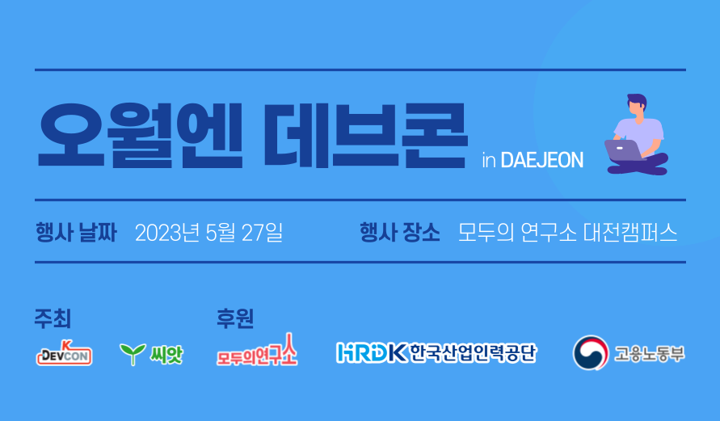
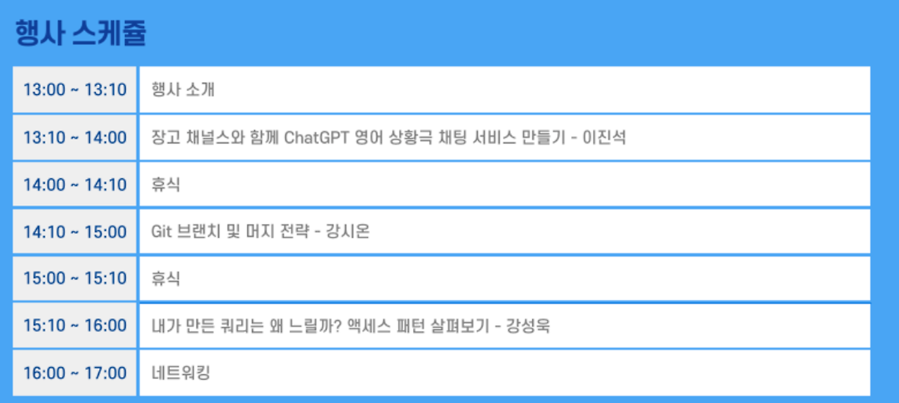

&#x20;

대전에서 개최된 5월엔 데브콘에 참가했다.

&#x20;

지방에서의 컨퍼런스는 처음이라 망설여졌는데,

결과는 대만족이었다.

&#x20;

역시 IT 컨퍼런스는 실패가 없는 것 같다. (나라서 그런건가?)

&#x20;

&#x20;

위와 같이 3개의 강연이 진행됐다.

각 강연에 대한 기억을 간직하기 위해 간략하게 정리해두려한다.

&#x20;

### 장고로 채팅서비스 만들기 

첫 강연의 장고는 옛날 친구를 오랜만에 만난 느낌이 들어 반가웠다.

&#x20;

내가 파이썬으로 라즈베리파이를 만지적거리던 대학교 시절

파이썬으로도 웹개발을 할 수 있다해서 가장 처음 접하게 된 백엔드 프레임워크가 장고여서다.

&#x20;

강연을 진행해주신 이진석님은 파이썬 개발자셨고,&#x20;

해외 파이콘도 열성적으로 참여하는 파이썬 러버셨다.

&#x20;

해서, 파이썬과 장고 그리고 chatgpt를 이용해 영어로 채팅하는 웹서비스를 한시간만에 뚝딱 만드시는 것을 보여주셨다.

&#x20;

내가 처음 장고를 사용했을 때는 진짜 아무것도 모를때여서 인지하지 못했는데,

장고가 생산성이 모든 프레임워크 중에서 가장 좋은 것 같다.

&#x20;

node.js같은 경우 최근이야 nestjs가 나오면서 생산성이 급증했지만,

그 전에는 모든 걸 레고조립하듯 직접 구현해야해서 프로젝트 세팅할때 조금 느린감이 없지 않았다.

&#x20;

또 스프링부트 같은 경우에도 설정이 단순하진 않았고, 입문하기에는 꽤 많이 빡센 내용들이 많았다.

그냥 모르고 따라하다가 조금만 실수하거나 놓치면 디버깅이 어려웠다.

&#x20;

근데 장고는 cli로 뚝딱.. 만드는 것 보고 꽤 충격이었다.

&#x20;

하지만 이젠 node.js에도 Nest.js가 있어 크게 부럽진 않았다. ㅋㅋㅋ

&#x20;

&#x20;

### 깃 브랜치 전략 

두번째 강연은 나와 같은 node.js 개발자인 김시온님이 발표해주셨다.

김시온님은 대전에서 개발자로 일을 하고 계셔서 신기했다.

&#x20;

대전이 은근 살기좋은 도시라 여기서 일하는 것도 나름 행복할 것 같다.

(20년 토종 지방인에게 서울은 너무 복잡... ㅠㅠ )

&#x20;

이 강연도 집중해서 들을 수 밖에 없었는데, 현재 우리 회사에 브랜치전략이 없다.

&#x20;

그냥 지라 티켓 번호로 feature브랜치만 만들고 master 브랜치로 병합되면 운영 환경으로 배포되고 있는데,

dev나 release 등 브랜치의 역할이 불분명하고 전략 같은 것도 개발자들이 모여서 이렇게 하자 정한게 없어서

&#x20;

우리만의 브랜치 전략이라도 좀 만들고 싶어서 강의를 열심히 듣게되었다.

&#x20;

깃 브랜치 전략, 깃헙 브랜치전략 등등 5가지정도 얘기해주셨는데&#x20;

들을땐 모두 이해되고 좋아보였는데 글을 쓰는 지금은 정확하게 기억이 나지 않는다.

&#x20;

하지만 강연을 통해 몸에서 한번 받아들여봤으니,

필요할 때 찾아보면 더 쉽게 체득할 수 있을 것 같다.

&#x20;

### 엑세스패턴 

마지막 강연은 AWS에서 DBA로 일하고 계신 강성욱님이 강연을 해주셨다.

&#x20;

강연 시작할때 미리 선전포고를 하셨다.

"매우 어려운 내용을 발표할거라서 아마 대부분 이게 무슨소리야 하실 거에요."

"하지만 이 강연을 들으면 내가 얼마나 더 노력해야하는지 느낄 수 있을 거에요."

&#x20;

그리고 강연을 듣고 바로 납득했다.

&#x20;

12가지 엑세스패턴을 말씀해주셨는데 너무 어렵고&#x20;

노트북을 가져가서 정리할 걸 후회했다.

&#x20;

그리고 말씀하신 것처럼 DB 공부 더 열심히 해야지 결심하게 되었다. ㅋㅋㅋㅋ

&#x20;

다만, 몇가지 머리에 뿌리박힌것은

DB 엔진을 이해하자!

그리고 실행계획을 습관화하자!

이다.

&#x20;

강연을 통해서 나에게 있어 좋은 쿼리를 작성하는 것에 대한 중요도가 더 높아지는 계기가 된 것 같다.

아무래도 우리 회사는 ORM을 사용하지 않고

드라이버 라이브러리로 생쿼리를 날리기 때문에 ㅎㅎㅎ

&#x20;

### 느낀점 

시작할 때 말했듯 IT 컨퍼런스는 실패없다는 것을 깨달았다 🤣

기회가 될 때마다, 그리고 시간이 될때마다 참여할 수 있는 컨퍼런스는 모두 참여해야지.