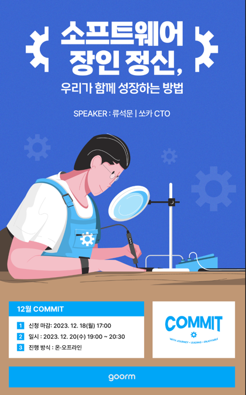
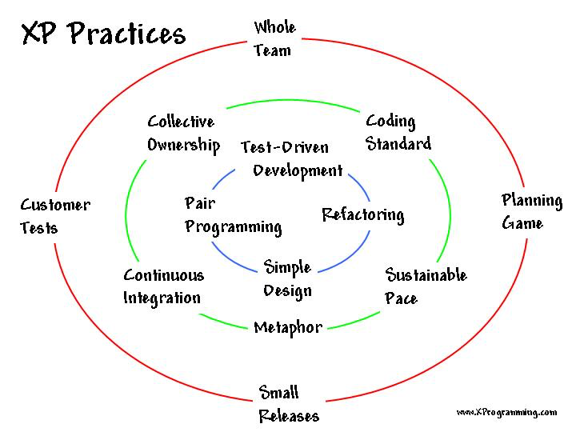
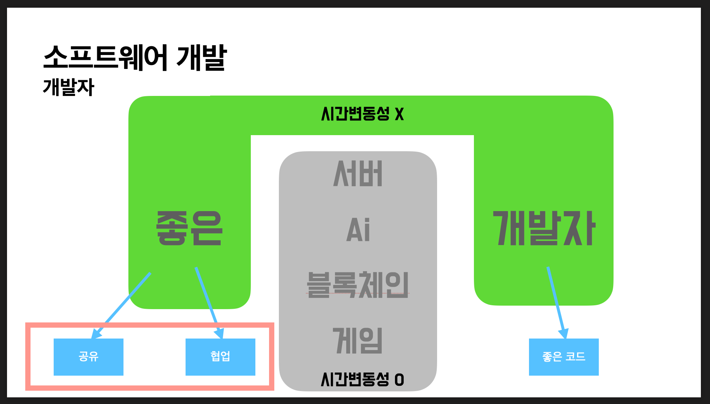

링크드인에서 쏘카 CTO로 근무중이신 류석문님이 컨퍼런스를 개최하신다는 소식을 접했다.

오랜만에 시간도 되어서 참여해야지 하고 봤더니 판교에서 하는 컨퍼런스였다.

&#x20;

더 기대되었다. 나도 언젠가 판교에서 일해보고 싶어서... ㅋㅋㅋㅋ

&#x20;

1시간동안 진행하셨고, 30분동안 네트워킹 시간을 가졌다. 발표중에 요즘 CTO가 되면서 2년째 프로그래밍을 못하고 계셔서 너무 슬프다고 하셨는데 표정이 진짜 슬퍼보이셔서 웃겼다..

&#x20;

1시간동안 진행됐던 세션에서 핵심 내용은 다음과 같이 두 가지로 추려지는 것 같다.

* 테스트코드의 중요성
* 좋은 개발자

&#x20;

### 테스트코드의 중요성 

테스트코드의 중요성에 대해 얘기해주시기전 애자일에 대해 먼저 말씀해주셨다.

&#x20;

류석문님이 네이버 개발자셨을 때 애자일 컨퍼런스에 우연히 참가하게됐고, 이런 개발 방식이 있다는 것이 문화충격을 받으셨다고 한다.

그래서 얼른 네이버에 도입을 해보았고, 나름 성공적인 결과를 얻고 한게임으로 가서도 애자일을 전파하셨다고 한다.

그렇게 애자일에 대해 직접 공부하고 적용하시면서 깨달으신 점을 공유해주셨다.

&#x20;먼저 애자일을 적용된 xp를 보여주셨다.

xp는 이렇게 3계층으로 구성되어 있고, 1계층부터 차례대로 지켜야 한다.

&#x20;

이때 1계층은 개발자에 대한 내용으로 좋은 개발자가 되는 내용을 담고 있다.

2계층은 개발팀에서 협업을 하기 위한 조건, 3계층은 다른부서와 협업을 하는 조건이다.

&#x20;

근데 애자일에 실패했다고 하는 기업들을 보면, 우리는 애자일을 하고 있다고 하지만 막상 자세히 들여다보면 1계층의 조건들은 충족하지도 않은채 2,3계층의 조건만 충족하려고 하고 있다는 것이다.

&#x20;

축구로 비유하면 아무나 11명을 데리고 아무리 좋은 전술과 좋은 복지, 좋은 감독을 들여도 프로 축구리그에서 우승하지 못하는 것과 같이 애자일 이전에 좋은 개발자가 되는 것이 먼저임을 말씀해주셨다.

&#x20;

그리고 좋은 개발자가 되는 조건 중 하나인 TDD를 강조하셨다.

&#x20;

### 좋은 개발자 

위에서는 애자일을 하기 위해 좋은 개발자가 되는 것을 얘기했고,

그리고 이 강연의 주제인 소프트웨어 장인정신과 연결되는 좋은 개발자란 무엇인가도 알려주셨다.

&#x20;

내용은 다음과 같다.

&#x20;

좋은 개발자는 도메인에 종속되지 않는다. 도메인은 내가 재직중인 회사 그리고 내 분야로 백엔드, 프론트, ai, 게임 등등을 얘기한다.

&#x20;이것을 나의 정체성으로 잡으면 안된다.

도메인은 시간변동성을 갖기에 지금은 ai 개발자가 높은 연봉을 받지만 언제가 ai개발자는 없어지고 새로운 분야의 개발자가 대세가 될 수도 있다. 그런데 나를 ai 개발자라고 정체성을 잡게되면 내 가치를 시장상황에 맡기는 꼴이 되기 때문이다.

반면, 내가 나를 좋은 개발자로 정체성을 잡으면 이는 시간변동성이 없고 시장상황에 영향을 받지 않을 수 있게 된다.

그럼 좋은 개발자는 무엇일까?

좋은 개발자는 공유를 하고, 협업을 잘하며 좋은 코드를 작성하는 개발자를 뜻한다.

&#x20;이처럼 좋은개발자가 된다면, 시장상황에 맞춰 내가 프론트 개발자가 될 수도, 게임 개발자가 될 수도 있는 것이다.

&#x20;

요즘 많이 고민하던 내용이어서 더 와닿았다.

나는 지금 블록체인 기업에 재직중이기에 블록체인에 관해 얼마나 많은 공부를 해야하는지 감을 잡지 못하고 있어서

너무 감동적이었다. 🥹

&#x20;

### 느낀점 

판교로 가서 좋았고,

맛있는 것도 주셔서 좋았고,

쏘카 CTO님과 얘기를 나눌 수 있어서 너무너무 좋았다.