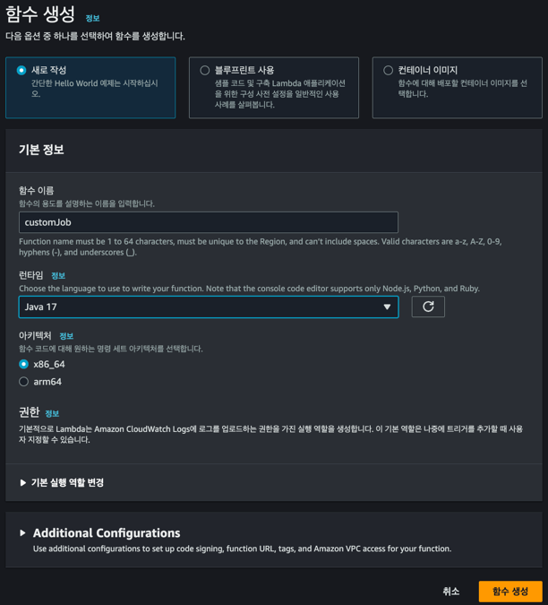
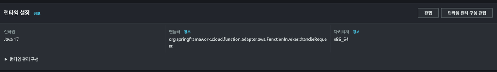
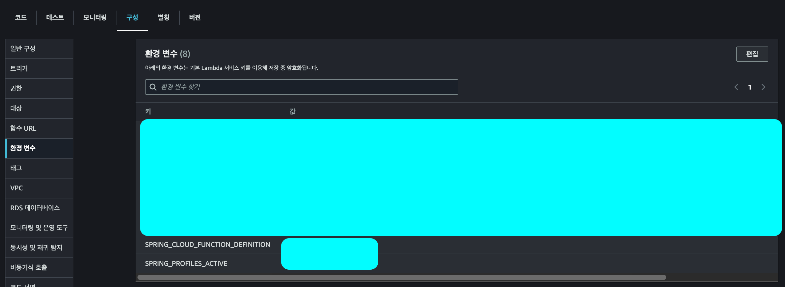
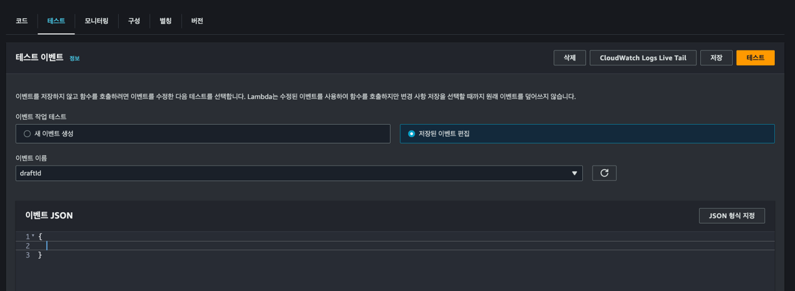
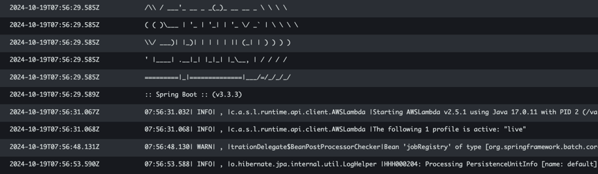

Spring Batch는 대량의 데이터를 효율적으로 처리할 수 있는 배치 처리 프레임워크로, AWS Lambda와 결합하여 서버리스 환경에서 배포할 수 있습니다. 

AWS Lambda는 프리티어를 지원하여 월 100만 건의 무료 요청과 월 40만 GB-초의 컴퓨팅 시간을 무료로 이용 가능합니다.


## 의존성 설치

먼저, AWS Lambda에서 Spring Batch 애플리케이션을 실행하기 위한 의존성을 추가해야 합니다. 

저는 `spring-cloud-function`을 사용했습니다.

```kotlin
implementation("org.springframework.cloud:spring-cloud-function-kotlin:3.2.8")
implementation("org.springframework.cloud:spring-cloud-function-adapter-aws:3.2.8")
```


## Fat Jar 빌드

AWS Lambda에서는 실행 가능한 Fat Jar 파일을 만들어야 합니다. 

Fat Jar는 모든 의존성을 포함한 단일 JAR 파일로, Lambda 환경에 배포할 수 있습니다.

#### 플러그인 설정

```kotlin
plugins {
    id("com.github.johnrengelman.shadow") version "7.1.0"
}
```

이 플러그인은 프로젝트에서 사용되는 모든 의존성을 포함한 Fat Jar를 생성하는 데 사용됩니다.

#### 빌드 설정

```kotlin
tasks.withType<Jar> {
    manifest {
        attributes["Start-Class"] = "com.kotlin.aiblogdraft.AiBlogDraftBatchApplicationKt"
    }
}

tasks.assemble {
    dependsOn("shadowJar")
}

tasks.withType<com.github.jengelman.gradle.plugins.shadow.tasks.ShadowJar> {
    archiveClassifier.set("aws")
    archiveFileName.set("batch.jar")
    dependencies {
        exclude("org.springframework.cloud:spring-cloud-function-web")
    }
    mergeServiceFiles()
    append("META-INF/spring.handlers")
    append("META-INF/spring.schemas")
    append("META-INF/spring.tooling")
    append("META-INF/spring/org.springframework.boot.autoconfigure.AutoConfiguration.imports")
    append("META-INF/spring/org.springframework.boot.actuate.autoconfigure.web.ManagementContextConfiguration.imports")
    transform(com.github.jengelman.gradle.plugins.shadow.transformers.PropertiesFileTransformer::class.java) {
        paths.add("META-INF/spring.factories")
        mergeStrategy = "append"
    }
}
```

`shadowJar`는 AWS Lambda에서 실행할 수 있는 JAR 파일을 생성하고, `spring.factories` 같은 여러 설정 파일들을 병합하여 Spring 환경 설정이 제대로 동작하도록 합니다.

Fat Jar를 빌드하는 이유는 AWS Lambda에서는 모든 실행 파일을 한 곳에 모아 실행해야 하기 때문입니다. 
이를 통해 모든 의존성을 포함한 하나의 실행 가능한 파일을 만들어 Lambda로 배포할 수 있습니다.


## Lambda 핸들러 구현

AWS Lambda는 함수로서 트리거되는 환경이므로, Lambda 핸들러를 구현해야 합니다. 

Spring Batch 작업을 Lambda 함수로 호출할 수 있도록 다음과 같이 구현할 수 있습니다.

```kotlin
class DraftContentJobHandler(
    private val objectMapper: ObjectMapper,
    private val jobLauncher: JobLauncher,
    private val customJob: Job,
) {
    @Bean
    fun customJobLauncher(): (String) -> Unit =
        { _ ->
            // 배치 작업의 파라미터를 설정합니다.
            val parameters = JobParametersBuilder().toJobParameters()
            
            // 작업 실행
            val jobExecution = jobLauncher.run(customJob, parameters)
            println("Job Execution Status: ${jobExecution.status}")
        }
}
```

`JobLauncher`를 사용해 배치 작업을 시작하고, `JobParametersBuilder`로 배치 작업에 필요한 파라미터를 생성할 수 있습니다.


## Lambda 설정

#### 생성



사용하는 자바 버전으로 람다를 생성합니다.

#### 런타임 핸들러



런타임설정에서 핸들러를 `org.springframework.cloud.function.adapter.aws.FunctionInvoker::handleRequest`로 변경합니다.

#### 환경 변수 설정



환경변수에 `SPRING_CLOUD_FUNCTION_DEFINITION` 키와 `customJobLauncher` 을 입력해줍니다.

#### 테스트



콘솔 테스트 탭에서 람다를 호출하면 다음과 같이 빌드 후 배치잡을 실행합니다.



<br>

이렇게 스케줄링을 위해서 Lambda와 CloudWatch Event Bridge를 연동해서 사용하기도 하고요.

또는 특정 메시지를 처리하기 위해 SQS와 연동해서 사용할 수 있으며
SQS의 메시지를 파싱하여 JobParameter로 추가해서 배치잡을 실행할 때 전달할 수도 있습니다.