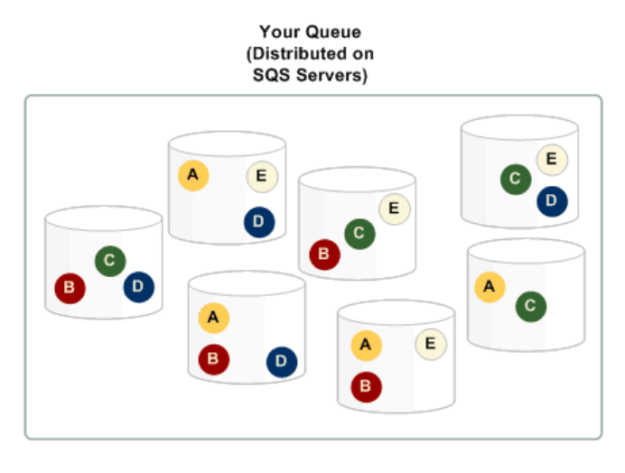
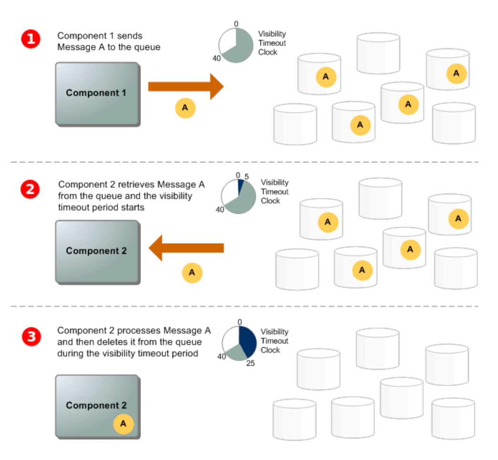

Node.js의 비동기 처리가 많아지면 애플리케이션 서버에 과부하가 발생할 수 있습니다.

또한 Node.js의 Promise 풀도 무한이 아닙니다.

그래서 비동기 처리를 위한 워커 서버를 분리해 부하를 분산시키는데 이때 다양한 메시지 브로커 또는 이벤트 브로커가 사용됩니다.

그중 SQS는 간편하고 안정적인 메시지 브로커이며 서버리스로 관리비용이 적어 애용하고 있습니다.

 

# 아키텍처

SQS는 분산 메시지 시스템으로 여러 가용 영역(AZ) 서버에서 메시지를 중복으로 저장합니다.

분산 메시징 시스템은 여러 서버에서 메시지를 효율적으로 전달하고 처리하는 것으로 메시지를 발송하는 발신자와 수신하는 수신자간에 비동기적으로 통신할 수 있게 해줍니다.

위 사진은 메시지가 처리되는 과정인데요.

생산자가 대기열로 메시지를 전송한 후 소비자가 이를 소비해 처리하고, 처리중에는 SQS서버에서 삭제되지 않고, 다른 소비자에게 보이지만 않습니다. 소비자는 메시지 처리를 완료하면 SQS 서버에서 메시지를 삭제합니다.

 

# 종류

SQS는 Standard와 FIFO 두 종류로 나뉘어집니다.

### Standard
---

* **순서 보장 없음:** 메시지가 큐에 도착한 순서대로 처리된다는 보장이 없음
* **중복 가능성:** 최소 1회를 보장하기 때문에 메시지가 2번 이상 수신될 수 있음
* **높은 처리량:** 대량의 메시지를 빠르게 처리할 수 있음 (초당 거의 무제한)

따라서 순서가 중요하지 않고 높은 처리량이 요구되는 시스템에서 사용합니다.

### FIFO
---

* **순서 보장:** 메시지가 큐에 도착한 순서대로 처리
* **중복 방지:** 메시지ID를 사용해 중복 처리를 방지 할 수 있음
* **제한된 처리량:** 표준 큐보다는 처리량이 제한적 (초당 최대 3000 TPS)

따라서 중복 방지가 필요하거나 순서가 중요한 시스템에서 사용합니다.

 

# 구성

standard와 fifo 모두 SQS로서 공통적인 구성 요소를 가지며,
또 각자에게만 설정되는 구성도 존재합니다.

### 공통 구성

---

#### 표시제한시간

대기열에서 수신한 메시지가 다른 소비자에게 보이지 않게 되는 시간입니다.

저는 메시지가 처리되고 삭제하기까지 평균 시간보다 2배정도 설정합니다.

만약 메시지 처리 시간이 길어져 표시제한시간을 넘어가게되면 다른 소비자에서 메시지를 읽을 수 있습니다.&#x20;

때문에 데이터베이스 upsert 경우 멱등성이 있으므로 괜찮지만, 사용자에게 푸시알림을 보낸다거나 데이터베이스 insert 행위같은 경우에는 중복처리되지 않도록 방어로직을 구현해야 합니다.

#### 전송지연

메시지가 대기열로 입력되어도 바로 처리되지 않아야 하는 경우에 전송지연 시간을 설정해서 메시지가 소비되지 않고 대기열에 머물러있을 시간을 설정할 수 있습니다.

#### 메시지 수신 대기 시간

0으로 설정하면 짧은 폴링이 되어서 빈응답으로 반환되는 경우가 잦기 때문에 즉각적인 응답이 요구되는 상황이 아니라면 긴폴링을 사용해 메시지가 메시지 대기열에 도달하거나 긴 폴링 제한 시간이 초과할 때까지 응답을 반환하지 않도록 합니다.

 

### Standard의 구성
---

#### 최소 1회 전송

표준 대기열은 삭제 중 메시지 사본을 저장하는 서버 중 하나를 사용할 수 없게되어 메시지 사본이 삭제되지 않아 소비자가 해당 메시지 복사본을 다시 가져올 수 있으므로 동일한 메시지를 두 번 이상 처리하더라도 부정적인 영향이 없도록 설계해야 합니다.

#### 수신핸들

소비자는 메시지 수신 시 수신핸들을 받아옵니다. 맥세지를 삭제하거나 메시지 표시를 변경(메시지 가져오기 취소를 위해 visabilityTimeOut = 0)하려면 메시지ID가 아닌 이 수신핸들을 지정해줘야합니다.

만약 메시지를 두번 이상 받으면 가장 최근에 받은 수신 핸들을 제공해야합니다.

 

### FIFO의 구성
---

#### 정확히 1회 처리

FIFO는 정확히 1회만 처리하는 대기열입니다.

#### 수신핸들

표준대기열과 마찬가지로 메시지를 삭제하거나 표시를 변경하려면 수신핸들을 지정해줘야 합니다.

#### 메시지 그룹 ID

논리적 그룹으로 동일 메시지 그룹에서의 메시지는 선입선출을 지키며, 가장 앞의 메시지가 삭제 또는 DLQ 이동이 되지 않으면 뒤에 있는 메시지는 수신되지 않습니다.

#### 메시지 중복 제거 ID

중복 제거 ID가 있는 메시지를 전송하면 중복제거 간격인 5분동안은 전달되지 않습니다.

이는 메시지가 삭제되어도 유효합니다.&#x20;

ex) 메시지 중복 제거 ID가 'abcd'인 메시지를 전송: 전달성공 -> 해당 메시지 수신 후 삭제 -> 메시지 중복 제거 ID가 'abcd'인 메시지를 전송 : 전달실패 -> 5분 후 메시지 중복 제거 ID가 'abcd'인 메시지를 전송: 전달성공

#### 중복 제거 범위

제거범위는 대기열의 모든 메시지를 중복 제거할 수 있고 또는 메시지 그룹 내에서만 중복 제거를 할 수도 있습니다.

#### 처리량 높이기

큐 생성 시, `높은 처리량의 FIFO 대기열`을 선택하게 되면 중복제거범위는 메시지그룹으로 설정되고 FIFO처리량 한도는 메시지그룹 ID당으로 설정됩니다.

이를 통해 Standard에 비해 처리량이 낮은 FIFO의 TPS를 한층 더 개선할 수 있습니다.

 

# 요청 재시도

SQS는 요청을 재시도하는 retryMode를 설정할 수 있습니다.

1. standard: 지수 백포프 전략을 사용하여 재시도 간격을 점진적으로 늘립니다. 권장하는 전략입니다.
2. adaptive: AWS 인프라의 상태와 클라이언트의 네트워크 상태를 고려하여 동적으로 재시도 간격을 조정합니다. 실험용이라서 권장되지 않습니다.

기본 재시도 횟수는 3회이지만, `maxAttempts`를 통해 재시도 횟수를 조절할 수 있습니다.

 

# 메시지 전송

### Standard 메시지 전송

---

표준대기열은 메시지별로 전송 지연 시간을 재설정해서 전송할 수 있습니다.

### FIFO 메시지 전송

---

메시지 그룹 ID, 메시지 중복 제거 ID를 포함시켜 보내야합니다.

단, FIFO 대기열을 콘텐츠 기반 중복 제거로 설정했다면 메시지 중복 제거 ID는 선택사항입니다.&#x20;

### Batch 전송

---

배치는 한 번의 요청으로 여러개의 메시지를 큐에 전송하거나 처리하는 단위를 의미합니다.

SQS는 SendMessageBatch를 지원하여 여러개의 메시지를 한 번의 요청으로 큐에 전송할 수 있습니다.

최대 개수는 10개입니다.

### Batch 수신

---

FIFO 대기열에서 메시지를 수신하는 경우 메시지 그룹별로 정렬이 되어있기 때문에 Batch로 가져오는 경우 하나의 메시지 그룹에 대해서 메시지를 가져옵니다.

예를 들어 MaxNumberOfMessages가 10이면, 1번 그룹에서 10개 미만의 메시지를 가지고 있고 2번 그룹에서 10개 이상의 메시지를 가지고 있는 경우 2번 그룹에서 메시지 10개를 가져옵니다.

> 전송과 달리 수신은 특정 메시지 그룹 ID를 사용하는 메시지를 수신하도록 요청할 수는 없습니다.

 

# DLQ

SQS는 실패된 메시지를 관리하는 대기열인 DLQ를 지원합니다.

처리가 실패한 이유를 확인할 수 있어서 디버깅하는데에 유용합니다.

배달 못한 편지 대기열을 설정하고 최대 수신수를 설정하면 최대 수신수가 되었음에도 삭제처리가 되지 않았다면 DLQ로 이동합니다.

SQS는 분산 시스템으로 메시지 수신 API 호출에서 성공적으로 반환되어 배달된 것으로 표시되더라도 소비자가 해당 메시지를 받지 못한 경우가 생길 수도 있기 때문에  최대 수신수를 1로 설정하는 것은 권장되지 않습니다.

### FIFO

---

FIFO 대기열이라면 DLQ도 FIFO 이어야 합니다.

이때 원본 메시지의 중복 제거 ID는 원본 메시지의 ID로 대체되어 두 개의 독립적인 메시지가 DLQ 중복 제거에 영향을 받지 않게 합니다.

### 제한시간 늘리기

---

메시지 수신 후 처리 중에 제한 시간이 부족한 경우 `ChangeMessageVisibility` 를 사용하여 제한 시간 값을 새로 지정할 수 있습니다.

`ChangeMessageVisibility` 호출 시점부터 새로 지정한 `VisibilityTimeout` 만큼시간을 세기 시작합니다.

 

 