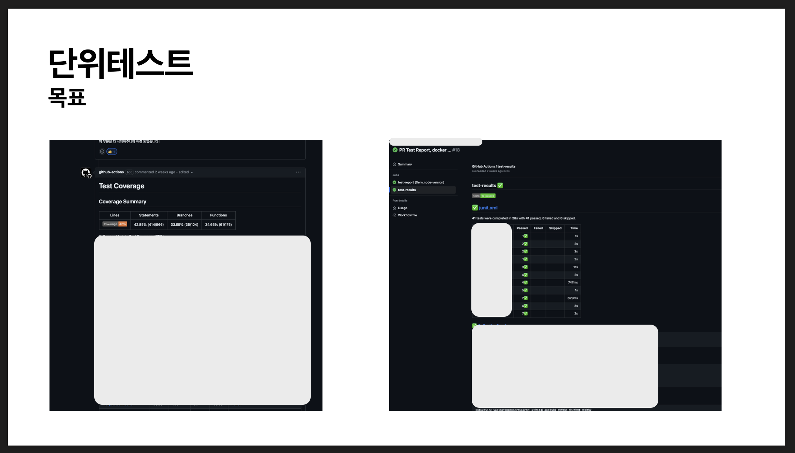

# 단위테스트 세미나

최근 회사에서 테스트코드를 도입했습니다.

아무래도 블록체인에 대한 도메인 지식이 부족해서 그나마 제가 가장 도움을 줄 수 있는 부분이라고 판단해서 적극적으로 주도했습니다.

테스트코드를 작성은 해봤지만 좋은 테스트코드를 공부해본 적은 없어서
`단위테스트`라는 책을 읽고 팀원 모두가 양질의 테스트코드를 작성할 수 있도록
세미나를 통해 공유했습니다.

다음의 내용들은 발표 내용의 일부입니다.

## 단위테스트 

위 두 책은 테스트코드 관련한 책들 중에서 가장 많이 알려진 책입니다.

저는 단위테스트 책을 읽었습니다.

단위테스트 책은 c#으로 작성되어 있긴하지만, 테스트코드에 대한 철학과 테스트코드 작성방법과 각 방법의 장단점이 이 책의 핵심이기때문에 크게 걱정하지 않았습니다.

그리고 막상 읽고보니 C#이 우려했던만큼 읽기 어렵지 않았고 오히려 그냥 자바를 읽는 것 같았어요.

근데 왜 책이름이 통합테스트도 아니고 단위테스트일까요?

테스트코드 피라미드를 보면 단위테스트가 70%를 차지하고 있습니다.

그 이유는 대부분 애플리케이션의 핵심은 비즈니스 로직이 있는 부분인데, 대개 비즈니스 로직은 도메인 계층에 위치해서 단위테스트를 통해 가능한 많은 비즈니스 시나리오의 예외상황을 확인해야하고, 그래서 단위테스트를 어떻게 작성하느냐에 따라 전체 테스트코드의 품질이 정해지게 되기때문입니다.

커버리지는 좋은 부정지표이지만, 나쁜 긍정지표이기 때문입니다.

좋은 부정지표라는 건 커버리지가 60%이하일때 테스트 코드 양이 부족하다는 지표가 될 수 있다는 의미이며, 나쁜 긍정지표라는 건 커버리지가 80%, 90% 같이 높은 수치라하더라도 고품질의 테스트가 구축되어 있는 지표는 될 수 없음을 의미합니다.

즉, 60% 이하일 때는 먼저 테스트코드의 양 부터 채워야 했습니다.

저 혼자만의 힘으로 테스트코드 60% 달성은 불가능하다고 생각했습니다.

그래서 PR이 생성되면 테스트커버리지를 측정해서 깃헙 봇이 커맨트를 남기도록 구축해두었습니다.

테스트 중 실패하거나 빌드 중 실패하는 것들을 확인할 수 있도록 PR마다 리포팅을 하는 액션도 구현해두었고요.

이를 통해 기능이 추가되더라도 테스트커버리지가 떨어지지 않도록 팀 전체가 확인할 수 있도록 했어요.

그리고 60%이상의 커버리지를 충족한하면 위와 같은 프로세스를 가져갈 생각입니다. (세미나 당시 55%정도)

다만, 이런 프로세스를 가져간다하더라도 테스트코드가 점점 개발에 방해가 되고 결국 테스트코드를 작성하지 않게 되는 경우가 많습니다.

그 근복적인 이유는 저품질의 테스트코드를 작성했기 때문입니다.

저품질의 원인을 설명드리기 전에 먼저 테스트코드의 두 가지 견해를 설명드리겠습니다.

`런던파`는 불변의존성 외 모든 의존성을 테스트대역으로 대체하는 것인데 불변의존성은 값 덩어리(vo 같은 것)를 의미하고요. 테스트대역이란 가짜를 의미합니다.

예를들어 api호출함수가 있고 그게 호출돼도 실제로 api를 호출하는 것이 아닌 내가 정한 값을 반환하도록 가짜 동작을 넣어두는 것이에요. 그럼 네트워크 통신은 일어나지 않고 어떤 값이 튀어나올지도 다 예상이 되므로 그에 맞춰 테스트코드를 작성할 수 있겠죠.

`고전파`는 공유의존성만 테스트대역으로 대체하는 것이고요.

공유의존성은 서로 다른 테스트가 공유할 수 있게 되는 의존성을 의미하는 데 보통 DB, 외부서비스들이 이러한 공유의존성에 해당합니다.&#x20;

이름만 보면 런던파가 더 좋아보입니다. 하지만 고전파가 더 좋습니다. 리팩터링 내성이 더 강하기 때문입니다.

리팩터링 내성이 뭘까요?

이렇게 두 개의 객체가 있고 B가 A에 의존하는 상황입니다. 저희는 B객체의 getZero를 테스트 해 볼 것인데요.

A의 `getNumber` 와 B의 `getZero`는 가 수정이 되었다고 가정해보겠습니다.

런던파로 테스트코드를 작성한 경우 B의 수정사항으로 테스트코드도 영향을 받아 수정이 되었습니다. 반면, 고전파의 테스트코드는 수정이 되지 않았죠.

이와같이 리팩터링에도 수정되지 않는 정도를 가르켜 리팩터링 내성이 강하다고 합니다.

리팩터링은 지속되는 서비스에서는 필수불가결하며, 좋은 개발자는 코드를 작성하는 모든 순간에 리팩터링을 동시 진행합니다. 근데 리팩터링을 할 때마다 테스트코드가 깨져버리면 테스트코드가 걸림돌이라고 느끼고 지우거나 주석처리를 해버립니다.

그렇기에 테스트코드를 지속 가능하게 하려면 꾸준히 관리를 해주어야 하며, 리팩터링 내성이 강한 테스트코드를 작성해야합니다.&#x20;

리팩터링이 강한 테스트코드는 런던파가 아닌 고전파이므로 저는 지속가능한 테스트코드를 위해 고전파를 선호합니다.

근데 Repository같은 경우엔 고전파 방식의 테스트코드를 작성하기 위해선 DB 연동이 필요합니다.

이때 DB에 대한 의존성을 여러 테스트가 공유하기 때문에 고전파를 적용할 수가 없습니다.

그래서 저희 팀은 어쩔 수 없이 런던파로 Repository의 통합테스트를 작성했는데요.

하지만 이렇게 작성된 테스트코드는 리팩터링 내성이 약해질 수 밖에 없기에 이것은 저희가 원하는 방향이 아니었습니다.

저희팀은 통합테스트도 고전파로 작성하기를 원했고, 이를 위해 테스트환경에 도커를 도입했습니다.

도커로 의존하는 DB를 띄우고 테스트용 애플리케이션을 연결시켜서 postgresql의 경우에는 typeorm의 싱크 플래그를 켜서 테이블을 생성시켜주었습니다.

(이때 만약 typeorm으로 fk를 걸어두었다면 싱크시 적용되지 않게 무시하는 옵션을 켜줘야 합니다. 테스트코드 작성할 때 굉장히 거슬리거든요.)

그리고 매 테스트마다 테스트에 사용한 테이블을 전체 delete 해줍니다. 레디스는 flushAll을 해주고요.

마지막으로 가장 중요한 작업인데 jest를 직렬로 실행시켜줍니다. jest는 기본적으로 테스트를 병렬로 실행시키기때문에 테스트 간 DB가 초기화되지 않은 상태를 공유할 수 있기 때문입니다.

여기까지 되면 db는 더이상 공유의존성이지만, 공유 되지 않는? 그런 존재가 됩니다.

왜냐하면 저희가 테스트환경에서 도커로 띄운 디비를 사용하기 때문에 어떤 외부의 영향으로 디비 데이터가 바뀔일이 없을 거고요. 테이블은 매 테스트마다 초기화되니 테스트간 공유되는 값도 없고요.

이렇게 테스트간 DB를 공유하지 않는 환경을 구축하고 나서, 저희는 런던파 테스트코드를 모두 고전파로 리팩토링했습니다.&#x20;

사실 테스트코드의 품질을 높이는 요소는 리팩터링 내성만 있지 않습니다.

회귀방지는 테스트코드가 버그를 얼마나 잘 방지하냐이고요. 빠른 피드백은 테스트코드의 실행속도를 의미합니다. 그리고 유지보수성 역시 좋은 테스트코드의 한 요소입니다.

이렇게 총  4가지 요소의 곱이 테스트코드의 품질을 결정합니다.

제가 곱이라고 한 이유는, 한 요소라도 0이되면 전체 품질이 0이 되기 때문입니다. 이때 회귀방지와 빠른 피드백, 그리고 리팩터링 내성 이 3가지는 상호배타적관계이기에 트레이드오프를 할 수 밖에 없게돼요. 저희는 이 중 리팩터링 내성에 집중해야하는데, 그 이유는 리팩터링 내성은 좋고 나쁨의 정도가 없이 0또는 1로만 책정되기 때문입니다.

결론적으로, 저희는 리팩터링 내성을 최대로 강화한 상태에서 회귀방지와 빠른피드백을 저울질 해서 테스트코드를 작성해야합니다.

리팩터링 내성을 높이는 비즈니스 코드작성법은 한 마디로 객체지향 프로그래밍입니다.

객체지향 프로그래밍은 깊은 공부가 필요하므로, 오브젝트라는 책과 객체지향의 사실과 오해라는 책을 통해 따로 공부를 하는 게 좋을 것 같습니다.

저는 여기서는 리팩터링 내성을 높이는 테스트 코드 작성법인 출력기반 테스트와 테스트 디커플링에 대해 얘기하겠습니다.

이렇게 주소를 설정하고 조회하는 객체와 주문을 생성하는 객체가 있다고 가정하겠습니다.

OrderService의 createOrder를 테스트해볼건데요.

출력기반, 상태기반, 통신기반 총 3가지 방식으로 테스트코드를 작성해보았습니다.

출력기반은 메서드 호출 후 반환 값을 테스트하는 것, 상태기반은 객체의 상태를 비교하는 것, 통신기반은 함수의 호출을 확인하는 것 입니다.

테스트 대상 함수가 아닌 의존중인 객체에서 수정사항이 발생되는 경우를 보겠습니다.&#x20;

이 경우, 상태기반 테스트가 깨지게 됩니다.

다음으로 테스트 대상 시스템의 함수를 리팩터링 해보겠습니다.

리팩터링 내성이 강하다면 테스트는 깨지지 않아야합니다.

하지만 이 경우, 상태기반과 통신기반 테스트는 모두 깨지게 됩니다.

즉, 출력기반 테스트가 리팩터링 내성이 가장 강하기때문에 가능하면 출력기반의 테스트코드를 작성해야 리팩터링 내성 그리고 테스트코드의 품질을 높일 수 있습니다.

다음은 테스트 독립성입니다.&#x20;

이렇게 많은 테스트코드가 작성되어 있는 경우 도메인 객체를 만드는 행위가 반복되어서 생성함수를 밖으로 분리해주었습니다.

이런 함수를 셋업함수라고 하는데요. 이때 두가지 문제가 발생합니다.

1. 테스트픽스처를 만드는 과정을 한눈에 확인하기 어렵다. 즉 리더빌리티가 떨어진다.
2. 이 테스트픽스처 만드는 함수를 사용하는 함수가 모두 결합되어버린다.

(테스트픽스처라는 건 SUT) 를 실행하기 위해 해줘야 하는 모든 것을 얘기합니다.)

예를 들어, 어떤 부분에서 잘못 작성된 테스트코드를 발견하고, 올바르게 수정하고자 셋업함수를 수정해주었습니다.

근데 셋업함수를 바꾸어주었더니 다른 테스트가 실패하게 됩니다.

이유는 테스트들이 셋업함수를 매개체로 공유되고 있기 때문입니다.

이런 결합을 끊어주어야 리팩터링 내성을 높일 수 있습니다.

방법은 간단합니다.

위와 같이 셋업함수를 구현해주면 테스트 간 결합을 끊어낼 수 있게 됩니다.

여기까지 보시면,&#x20;

뭐가이렇게 복잡해\~ 이런거 할시간없어! 이거 만들고 관리하는 비용이 더 크겠다!

이렇게 생각하실 수 있습니다.

하지만 한번의 바퀴 교체가 앞으로의 모든 일을 더 편한게, 더 적게, 더 높은 성과를 내게 하는 방법일 수 있습니다.

조금만 더 노력하면 동그란 바퀴가 끼워질테니 모두 포기하지 마시고 꼭 한번 테스트코드 도입 그리고 좋은 테스트코드 작성에 도전해보시길 바랍니다.
